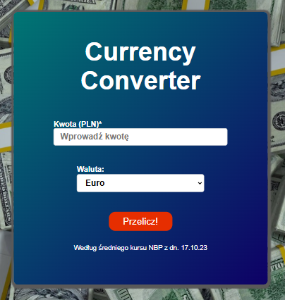

# 🌍 Currency Converter

## 🚀 Explore the Website

Check it out here: [Currency Converter](https://gyrletta.github.io/Currency-Converter-App/)

## 📚 Description

Welcome to my **Currency Converter** application! 🎉 This project is a practical web tool that allows users to convert amounts between Polish Zloty (PLN) and various foreign currencies. It demonstrates my progress in frontend development, showcasing essential skills and modern web technologies:

### Key Features:

- ✨ **Real-time Currency Conversion:** The app fetches and calculates exchange rates based on user input.
- ✨ **Dynamic Date and Time Display:** Integrated a live clock component that shows the current date and time using custom hooks.
- ✨ **React Hooks:** Utilized React's built-in hooks such as `useState`, `useEffect`, and custom hooks (`useCurrentDate`) to manage state and effects.
- ✨ **Styled Components:** Used `styled-components` for writing component-level styles with CSS-in-JS.
- ✨ **Local Storage:** The app uses local storage to save user preferences or results.

🖼️ **Screenshot**  
Below is a screenshot of the application interface:

## 🛠️ Technologies Used

Here’s what I’ve used to build this project:

- **React** – A JavaScript library for building user interfaces.
- **Styled Components** – A library for styled-components in React, using tagged template literals for styles.
- **JavaScript** – To implement the conversion logic, user input handling, and dynamic interactions.
- **useState & useEffect** – React hooks for managing state and side effects.
- **Custom Hook (`useCurrentDate`)** – A custom hook to handle live updates of the current date and time.
- **Local Storage** – To persist the conversion results or settings across page reloads.
- **Favicon** – Added a favicon for a personalized touch.
- **Google Fonts** – Integrated Google Fonts to improve typography and design.
- **Open Graph Metadata** – Included metadata for better presentation when sharing the link.

## 💡 Getting Started with Create React App

This project was bootstrapped with [Create React App](https://github.com/facebook/create-react-app).

### Available Scripts

In the project directory, you can run:

### `npm start`

Runs the app in the development mode.\
Open [http://localhost:3000](http://localhost:3000) to view it in your browser.

The page will reload when you make changes.\
You may also see any lint errors in the console.

### `npm test`

Launches the test runner in interactive watch mode.\
See the section about [running tests](https://facebook.github.io/create-react-app/docs/running-tests) for more information.

### `npm run build`

Builds the app for production to the `build` folder.\
It correctly bundles React in production mode and optimizes the build for the best performance.

The build is minified and the filenames include the hashes.\
Your app is ready to be deployed!

See the section about [deployment](https://facebook.github.io/create-react-app/docs/deployment) for more information.

### `npm run eject`

**Note: this is a one-way operation. Once you `eject`, you can't go back!**

If you aren't satisfied with the build tool and configuration choices, you can `eject` at any time. This command will remove the single build dependency from your project and allow you to manage your own build configuration.
